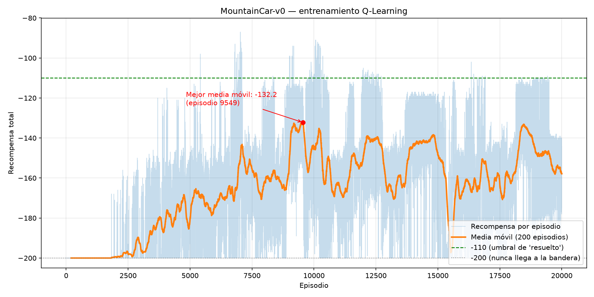
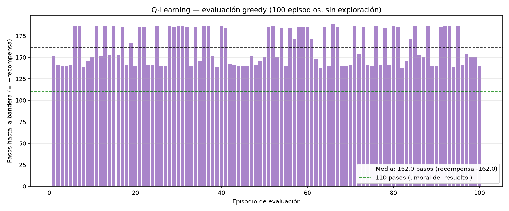
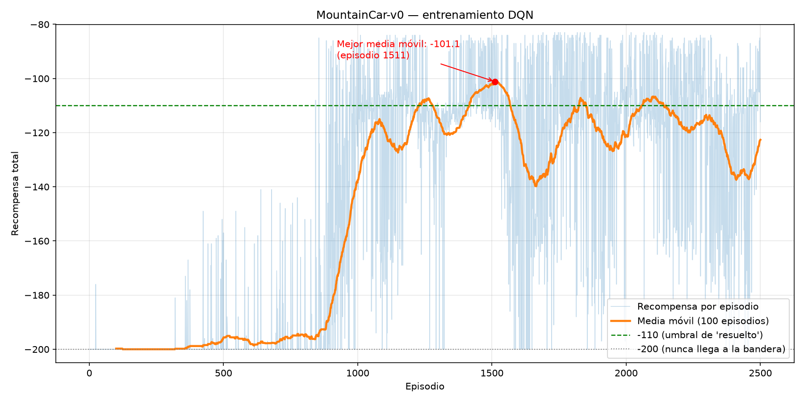
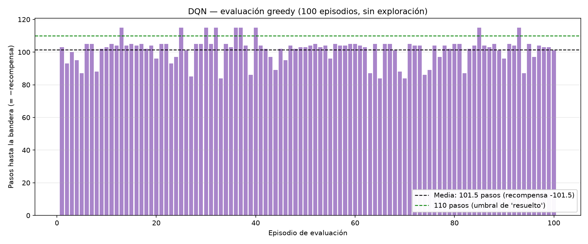
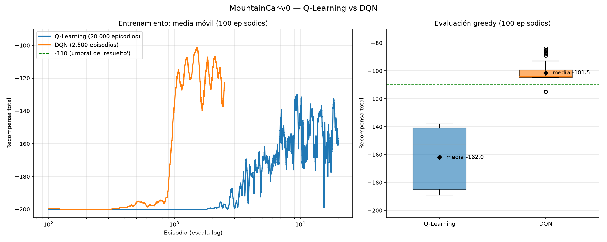

A hands-on repo for understanding how Reinforcement Learning works.
Train, inspect, and visualise RL agents on [MountainCar-v0](https://gymnasium.farama.org/environments/classic_control/mountain_car/) (or any other Gymnasium environment).

**This repo is a set of exercises.** The CLI, training loops and persistence are
written; the algorithms themselves are left as marked `EXERCISE` stubs for you
to fill in. Start with **[EXERCISES.md](EXERCISES.md)**.

## Team — Group 6

- Felipe Barreto
- Angie Paola Espinosa Hurtado
- Luis Jorge García Camargo
- Valeria Sofía Guerrero Mejía
- Andrés Felipe Miranda Díaz
- Juan Pablo Moreno Mendoza
- Luis Eduardo Uribe Álvarez

## MountainCar-v0 environment

An under-powered car sits in a valley. Its engine is too weak to drive straight
up the right-hand hill, so the only way out is to rock back and forth and build
up momentum. The goal is to reach the flag at position `0.5`.

### State (observation) — 2 continuous values

| Index | Variable | Description | Range |
|:---:|---|---|---|
| 0 | position | Position of the car along the x-axis | -1.2 to 0.6 |
| 1 | velocity | Velocity of the car | -0.07 to 0.07 |

### Actions — 3 discrete

| Value | Action |
|:---:|---|
| 0 | Accelerate to the left |
| 1 | Don't accelerate |
| 2 | Accelerate to the right |

### Rewards

| Event | Reward |
|---|---|
| Every step taken | **-1** |
| Reaching the flag (position >= 0.5) | episode ends |

The reward is `-1` per step and nothing else, so the total return is simply the
negative of the episode length: **less negative is better**. Episodes are cut
off after 200 steps, which gives a floor of `-200` for a policy that never
reaches the flag. Anything around `-110` or better is considered solved.

This flat reward is what makes MountainCar interesting: there is no gradient to
follow toward the goal, so the agent has to stumble onto the flag by
exploration before it can learn anything at all.

## Install

```bash
uv sync
```

## Usage

All commands are exposed through the `mountaincar` CLI:

```bash
uv run mountaincar <command>
```

| Command | What it does |
|---|---|
| `version` | Show the package version |
| `list` | List the agents and whether each has a save file |
| `inspect` | Print the state/action spaces and some random transitions |
| `init <agent>` | Create a new, untrained agent and save it |
| `train <agent>` | Train an agent (resumes from its save if one exists) |
| `load <agent>` | Print a saved agent's info, optionally evaluate it |
| `sim <agent>` | Play episodes with a trained agent, printed step by step |
| `render <agent>` | Play episodes in a graphical window |
| `delete <agent>` | Delete an agent's save file |

`<agent>` is either `qlearning` or `dqn`.

### Example session

```bash
# See what the environment looks like
uv run mountaincar inspect --steps 3

# Train the tabular agent
uv run mountaincar train qlearning --episodes 10000

# How did it do?
uv run mountaincar load qlearning --eval

# Watch it drive
uv run mountaincar render qlearning --episodes 3
```

### Reproducing our results

`scripts/experimento.py` trains an agent, saves it to `saves/` (the same path the
CLI uses), evaluates it on 100 greedy episodes (no exploration) and writes the
training curve, the evaluation plot and a metrics summary to `results/<agent>/`:

```bash
uv run python scripts/experimento.py qlearning --episodes 20000   # ~2 min
uv run python scripts/experimento.py dqn --episodes 2500         # ~13 min on CPU
uv run python scripts/comparacion.py                              # Q-Learning vs DQN plot
```

Both runs use a fixed seed (`--seed 0` by default). Afterwards the CLI works on the
trained agents, e.g. `uv run mountaincar load dqn --eval` or
`uv run mountaincar render dqn --episodes 3`.

The notebooks in `notebooks/` hold our first hyperparameter experiments; run them
from the repository root inside the `uv sync` environment.

## Agents

Both agents live in `src/mountain_car/agents/` and are written from scratch
(no Stable-Baselines3 or similar), so every part of the algorithm is visible --
and, in this repo, **partly left for you to write**. See [EXERCISES.md](EXERCISES.md).

### `qlearning` — tabular Q-Learning

The observation is only 2-dimensional and the environment publishes hard bounds
for both dimensions, so the state space is discretised into an
`n_bins x n_bins` grid (400 states by default) and stored in a plain Q-table.

Defaults: `n_bins=20`, `lr=0.1`, `gamma=0.99`, epsilon `1.0 -> 0.01` decaying by
`0.9995` per episode. A correct implementation scores about `-133` and reaches
the flag in 100/100 episodes, after roughly 20k episodes (~4 min).

### `dqn` — Deep Q-Network

A small MLP on the raw 2-D observation, trained with experience replay and a
target network. A correct implementation scores about `-106` and reaches the
flag in 100/100 episodes, after roughly 2500 episodes (~5 min on CPU) -- better
than the tabular agent, and past the conventional "solved" threshold of `-110`.

Getting there takes more than transcribing the DQN pseudocode. MountainCar has
a reward structure that defeats the textbook version of the algorithm, and
Exercise 3 is about finding out how and why. That exercise ships with a ladder
of progressive clues, so it is a guided investigation rather than a wall.

> A note on hardware: none of this needs a GPU. The network is tiny and the
> batches are small, so a gradient step costs about 0.5 ms on CPU and the
> bottleneck is stepping the environment, not matrix multiplication. On a GPU
> this would most likely be *slower*, because per-kernel launch overhead would
> dominate work this small.

## What we implemented

### Q-Learning — [`qlearning.py`](src/mountain_car/agents/qlearning.py)

- **`discretize`**: each dimension is split into 20 bins with `np.digitize`, so a
  state is one cell of a 20×20 grid, used as a tuple key into the Q-table.
- **`select_action`**: epsilon-greedy; with `deterministic=True` it never explores.
- **`_update`**: the TD update

  ```
  target  = r + gamma * max_a' Q(s', a')     (just r if the episode terminated at the flag)
  Q(s, a) += lr * (target - Q(s, a))
  ```

### DQN — [`dqn.py`](src/mountain_car/agents/dqn.py)

- **`QNetwork`**: MLP `2 → 128 → 128 → 3`, ReLU on the hidden layers, no output activation.
- **`_learn`**: samples a mini-batch of 64 transitions from the replay buffer and
  minimises the MSE against the Bellman target computed with the frozen target network
  (synced every 10 episodes):

  ```
  target = r + gamma * max_a' Q_target(s', a') * (1 - terminated)
  loss   = MSE(Q(s, a), target)
  ```

- **`select_action`**: exploration is temporally correlated: when exploring, the agent
  repeats its previous action with probability 0.9, so it can produce the sustained
  pushes needed to rock out of the valley. Evaluation stays purely greedy.

## Training schemes

- [Q-Learning training scheme (PDF)](docs/Esquema_del_entrenamiento_de_Q-Learning.pdf)
- [DQN training scheme (PDF)](docs/Esquema_del_entrenamiento_de_DQN.pdf)

## Results

Evaluation metrics are over **100 greedy episodes** (no exploration) with the final
agent of each run. Full numbers are in `results/<agent>/resumen.json`.

| Agent | Training episodes | Training time | Best moving average (training) | Evaluation mean ± std | Reached the flag |
|---|---:|---:|---:|---:|---:|
| Q-Learning | 20,000 | 2 min | **−132.2** (window 200) | −162.0 ± 20.6 | **100/100** |
| DQN | 2,500 | 13 min | **−101.2** (window 100) | **−101.5 ± 7.5** | **100/100** |

### Q-Learning





**Comment.** For the first ~1,800 episodes the reward is stuck at −200: the agent has
never reached the flag, so there is nothing to propagate. Once it does, that information
flows backwards through the Q-table and the moving average climbs to its best value of
**−132.2** (episode 9,549). After that it oscillates between −135 and −170: with only 400
cells, different states share a cell and the policy cannot get any finer. In the final
evaluation it reaches the flag in **100/100 episodes** with a mean of **−162** (range −138
to −189). It solves the task consistently, although it does not reach the −110 threshold.

### DQN





**Comment.** For the first ~350 episodes DQN is also stuck at −200. The correlated
exploration then starts producing the first successes, and between episodes 850 and
1,000 the moving average jumps from about −195 to −140 as the network generalises what
it learned to nearby states. The best moving average, **−101.2**, is reached at episode
1,511. After that the training curve oscillates between about −108 and −140. That is expected:
during training the agent still explores (ε never goes below 0.01, and each exploratory
action is repeated with probability 0.9), and the network keeps changing as the buffer
fills with new data. With exploration switched off, the final agent reaches the flag in
**100/100 episodes** with a mean of **−101.5** (range −84 to −115). That clears the
"solved" threshold of −110 and beats tabular Q-Learning by about 60 steps per episode,
because the network works on the continuous state instead of a 20×20 grid.

### Q-Learning vs DQN



| | Q-Learning | DQN |
|---|---:|---:|
| Evaluation mean (100 greedy episodes) | −162.0 | **−101.5** |
| Standard deviation | ±20.6 | **±7.5** |
| Best / worst evaluation episode | −138 / −189 | **−84 / −115** |
| Reached the flag | 100/100 | 100/100 |
| Reaches the −110 "solved" threshold | No | **Yes** |
| Training episodes | 20,000 | **2,500** |
| Training time (CPU) | **2 min** | 13 min |

- **Performance:** DQN needs about **60 fewer steps per episode** to reach the flag and
  clears the −110 threshold; Q-Learning does not.
- **Stability:** DQN's evaluation spread is almost 3 times smaller. Its worst episode (−115)
  is better than Q-Learning's best one (−138).
- **Sample efficiency:** DQN learns with **8 times fewer episodes**. It starts improving
  around episode 850, while Q-Learning needs about 2,000 episodes just to leave −200.
- **Cost:** each DQN episode is much more expensive (a gradient step per environment
  step), so in wall-clock time Q-Learning is about 6 times faster.
- **Why:** the Q-table only sees 400 cells, so states that need different actions share
  a cell and the policy cannot get finer. The DQN network works on the continuous
  (position, velocity) and generalises between nearby states, so every success also
  improves the estimates of states it has not visited exactly.

## Project layout

```
src/mountain_car/
├── cli.py              # argparse CLI, one command per function
└── agents/
    ├── qlearning.py    # tabular Q-Learning
    └── dqn.py          # DQN: QNetwork, ReplayBuffer, DQNAgent
scripts/
├── experimento.py      # train + evaluate + plots and summary
└── comparacion.py      # Q-Learning vs DQN comparison plot
notebooks/              # first hyperparameter experiments
results/
├── qlearning/          # evidence of the best Q-Learning result
├── dqn/                # evidence of the best DQN result
├── comparacion.png     # Q-Learning vs DQN
└── primeros_intentos/  # plots and models from our first attempts
saves/                  # agent save files land here (not committed)
docs/
├── Esquema_del_entrenamiento_de_Q-Learning.pdf
└── Esquema_del_entrenamiento_de_DQN.pdf

EXERCISES.md            # the exercises: what to implement, in what order
```
