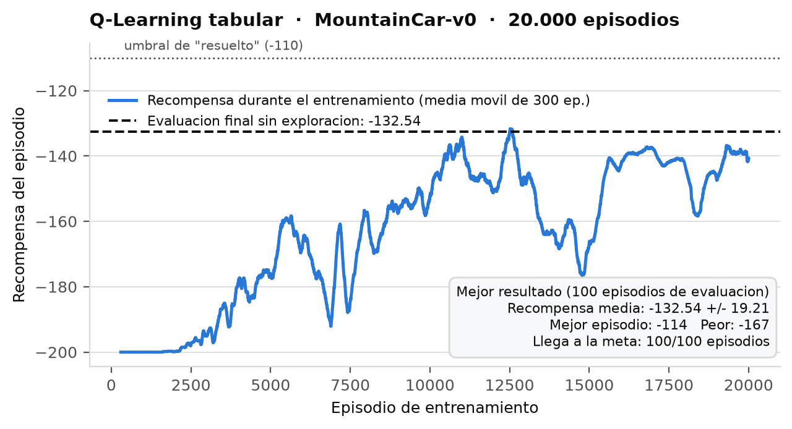
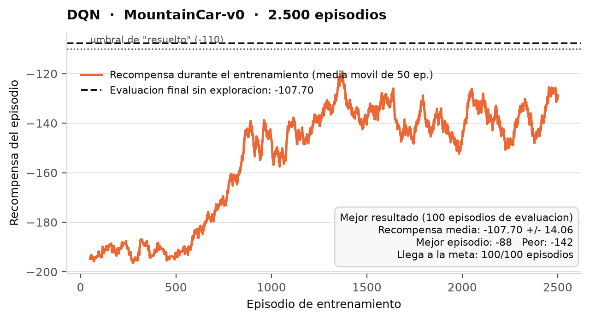

A hands-on repo for understanding how Reinforcement Learning works.
Train, inspect, and visualise RL agents on [MountainCar-v0](https://gymnasium.farama.org/environments/classic_control/mountain_car/) (or any other Gymnasium environment).

**This repo is a set of exercises.** The CLI, training loops and persistence are
written; the algorithms themselves are left as marked `EXERCISE` stubs for you
to fill in. Start with **[EXERCISES.md](EXERCISES.md)**.

## MountainCar-v0 environment

An under-powered car sits in a valley. Its engine is too weak to drive straight
up the right-hand hill, so the only way out is to rock back and forth and build
up momentum. The goal is to reach the flag at position `0.5`.

### State (observation) — 2 continuous values

| Index | Variable | Description | Range |
|:---:|---|---|---|
| 0 | position | Position of the car along the x-axis | -1.2 to 0.6 |
| 1 | velocity | Velocity of the car | -0.07 to 0.07 |

### Actions — 3 discrete

| Value | Action |
|:---:|---|
| 0 | Accelerate to the left |
| 1 | Don't accelerate |
| 2 | Accelerate to the right |

### Rewards

| Event | Reward |
|---|---|
| Every step taken | **-1** |
| Reaching the flag (position >= 0.5) | episode ends |

The reward is `-1` per step and nothing else, so the total return is simply the
negative of the episode length: **less negative is better**. Episodes are cut
off after 200 steps, which gives a floor of `-200` for a policy that never
reaches the flag. Anything around `-110` or better is considered solved.

This flat reward is what makes MountainCar interesting: there is no gradient to
follow toward the goal, so the agent has to stumble onto the flag by
exploration before it can learn anything at all.

## Install

```bash
uv sync
```

## Usage

All commands are exposed through the `mountaincar` CLI:

```bash
uv run mountaincar <command>
```

| Command | What it does |
|---|---|
| `version` | Show the package version |
| `list` | List the agents and whether each has a save file |
| `inspect` | Print the state/action spaces and some random transitions |
| `init <agent>` | Create a new, untrained agent and save it |
| `train <agent>` | Train an agent (resumes from its save if one exists) |
| `load <agent>` | Print a saved agent's info, optionally evaluate it |
| `sim <agent>` | Play episodes with a trained agent, printed step by step |
| `render <agent>` | Play episodes in a graphical window |
| `delete <agent>` | Delete an agent's save file |

`<agent>` is either `qlearning` or `dqn`.

### Example session

```bash
# See what the environment looks like
uv run mountaincar inspect --steps 3

# Train the tabular agent
uv run mountaincar train qlearning --episodes 10000

# How did it do?
uv run mountaincar load qlearning --eval

# Watch it drive
uv run mountaincar render qlearning --episodes 3
```

## Agents

Both agents live in `src/mountain_car/agents/` and are written from scratch
(no Stable-Baselines3 or similar), so every part of the algorithm is visible --
and, in this repo, **partly left for you to write**. See [EXERCISES.md](EXERCISES.md).

### `qlearning` — tabular Q-Learning

The observation is only 2-dimensional and the environment publishes hard bounds
for both dimensions, so the state space is discretised into an
`n_bins x n_bins` grid (400 states by default) and stored in a plain Q-table.

Defaults: `n_bins=20`, `lr=0.1`, `gamma=0.99`, epsilon `1.0 -> 0.01` decaying by
`0.9995` per episode. A correct implementation scores about `-133` and reaches
the flag in 100/100 episodes, after roughly 20k episodes (~4 min).

### `dqn` — Deep Q-Network

A small MLP on the raw 2-D observation, trained with experience replay and a
target network. A correct implementation scores about `-106` and reaches the
flag in 100/100 episodes, after roughly 2500 episodes (~5 min on CPU) -- better
than the tabular agent, and past the conventional "solved" threshold of `-110`.

Getting there takes more than transcribing the DQN pseudocode. MountainCar has
a reward structure that defeats the textbook version of the algorithm, and
Exercise 3 is about finding out how and why. That exercise ships with a ladder
of progressive clues, so it is a guided investigation rather than a wall.

> A note on hardware: none of this needs a GPU. The network is tiny and the
> batches are small, so a gradient step costs about 0.5 ms on CPU and the
> bottleneck is stepping the environment, not matrix multiplication. On a GPU
> this would most likely be *slower*, because per-kernel launch overhead would
> dominate work this small.

## Project layout

```
src/mountain_car/
├── cli.py              # argparse CLI, one command per function
└── agents/
    ├── qlearning.py    # tabular Q-Learning
    └── dqn.py          # DQN: QNetwork, ReplayBuffer, DQNAgent
saves/                  # agent save files land here
docs/
├── Esquema_del_entrenamiento_de_Q-Learning.pdf
└── Esquema_del_entrenamiento_de_DQN.pdf

EXERCISES.md            # the exercises: what to implement, in what order
```

---

# Entrega: Maestría en Inteligencia Artificial

Universidad de La Sabana. Simulación y Aprendizaje por Refuerzo.

| Agente | Responsables |
|---|---|
| Q-Learning tabular (Ejercicio 1) + esquema | Equipo |
| DQN (Ejercicios 2 y 3) + esquema | Juan Pablo Moreno Mendoza, Andrés Felipe Miranda Díaz |

## Qué se implementó

Los tres bloques marcados como `EXERCISE` en el repositorio original:

| | Archivo | Qué se escribió |
|---|---|---|
| 1 | `agents/qlearning.py` | Discretización del estado, política epsilon-greedy y actualización TD de la tabla Q |
| 2a | `agents/dqn.py` | `QNetwork`: red 2 → 128 → 128 → 3, ReLU en las capas ocultas y sin activación en la salida (17.283 parámetros) |
| 2b | `agents/dqn.py` | `_learn()`: lote de 64, `gather` sobre las acciones tomadas, máximo de la red objetivo sin gradiente, objetivo de Bellman y paso de descenso |
| 3 | `agents/dqn.py` | `select_action()`: corrección de la exploración |

## El problema del Ejercicio 3 y cómo se resolvió

Con los Ejercicios 2a y 2b correctos, DQN entrena sin errores y no aprende nada: reporta −200,00 durante 1000 episodios, sin variación.

El diagnóstico se hizo con cuatro mediciones.

1. El código de aprendizaje funcionaba. El mismo agente, sin modificar, entrenado 200 episodios en `CartPole-v1`, pasó de 21,12 a 284,28. La red, la actualización y el buffer estaban bien, así que el fallo era específico de MountainCar.

2. El agente nunca había visto la meta. Sobre 300 episodios con acciones al azar hubo 0 llegadas a la bandera y las 300 se cortaron por el límite de 200 pasos. La posición máxima promedio fue −0,389 y la mejor de las 300 fue −0,163, con la meta en 0,5. El carro no salió del valle en ninguno.

3. La red había aprendido que daba igual qué hacer. En 200 estados al azar, la diferencia media entre los valores de las tres acciones era 0,0058, prácticamente cero, y el valor medio se acercaba a −100, que es la suma descontada de −1 para siempre. Con los datos que vio, esa conclusión era correcta.

4. El comportamiento necesario era inalcanzable. Salir del valle exige unos 20 empujones seguidos en la misma dirección. Sorteando una acción nueva en cada paso entre tres opciones, eso tiene probabilidad (1/3)^20 ≈ 3 · 10⁻¹⁰, así que entrenar más episodios no cambia nada.

La corrección está en los datos que se recogen. Sorteando en cada paso, las acciones consecutivas son independientes y se cancelan entre sí, de modo que hay que hacerlas dependientes en el tiempo. Cuando el agente decide explorar, mantiene esa acción durante 25 pasos en lugar de uno. Con eso las llegadas a la meta pasan de 0/300 a 46/300. No se modificó la regla de actualización, la recompensa ni el entorno.

## Resultados

Evaluación sobre 100 episodios con política voraz, sin exploración:

| Agente | Recompensa media | Mejor episodio | Llega a la meta |
|---|---|---|---|
| Q-Learning tabular | −132,54 ± 19,21 | −114 | 100/100 |
| DQN | −107,70 ± 14,06 | −88 | 100/100 |

### Q-Learning tabular



Necesita 20.000 episodios. Se mantiene en el piso de −200 durante los primeros 2.000, hasta que el azar da con la bandera por primera vez, y a partir de ahí sube. La curva no se estabiliza: oscila entre −140 y −175 hasta el final, porque la discretización en una malla de 20×20 agrupa estados distintos en la misma celda y la política no llega a afinarse más. Resuelve el entorno en los 100 episodios de evaluación, sin alcanzar el umbral de −110.

### DQN



Llega a un resultado mejor con 8 veces menos episodios: 2.500 frente a 20.000. Arranca plano en −195 mientras la exploración es casi total, despega hacia el episodio 600 cuando ya hay llegadas a la meta en la memoria, y se estabiliza alrededor de −130.

La curva de entrenamiento se queda en −130 mientras la evaluación da −107,70. La diferencia es la exploración: durante el entrenamiento las rachas de 25 pasos arruinan el episodio en curso, y en la evaluación no hay exploración.

La ventaja sobre la tabla viene de no discretizar. La red recibe la posición y la velocidad como números continuos y generaliza entre estados parecidos, mientras que la tabla trata cada celda de la malla por separado.

### Sobre la elección de los 25 pasos

Se probaron 20, 25 y 30 con 3 entrenamientos independientes cada uno y 100 episodios de evaluación por entrenamiento:

| Pasos | Media de las 3 corridas | Desviación entre corridas |
|---|---|---|
| 20 | −113,61 | 13,79 |
| 25 | −103,69 | 4,06 |
| 30 | −104,58 | 2,41 |

Las nueve corridas resolvieron el entorno en 100/100 episodios. Los valores 25 y 30 dan resultados indistinguibles entre sí. El 20 alcanza medias parecidas pero es mucho más inestable: una de sus tres corridas cayó a −132,65. Se adoptó 25 por su estabilidad.

Un solo entrenamiento por configuración no habría permitido distinguir nada, porque la variación entre corridas del mismo valor es mayor que la diferencia entre valores distintos.

## Cómo reproducirlo

```bash
uv sync                           # si falla: uv python install 3.11
uv run mountaincar inspect        # ver el entorno

# Q-Learning (unos 4 minutos)
uv run mountaincar train qlearning --episodes 20000
uv run mountaincar load qlearning --eval

# DQN (unos 20 minutos)
uv run mountaincar train dqn --episodes 2500
uv run mountaincar load dqn --eval

# ver al agente conducir
uv run mountaincar render dqn --episodes 3
```

Los agentes entrenados se guardan en `saves/`, que está en `.gitignore`, así que hay que entrenarlos localmente.

Todo corre en CPU. Se midió que la GPU es más lenta para esta carga, 0,78 ms por paso de gradiente frente a 0,55 ms: la red es tan pequeña que el coste de lanzar cada kernel pesa más que el cálculo, y el cuello de botella real es avanzar la simulación del entorno.
